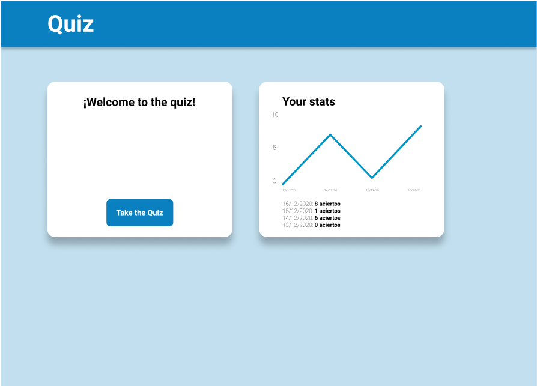
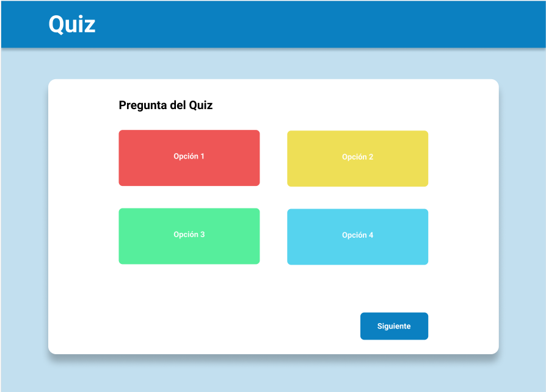
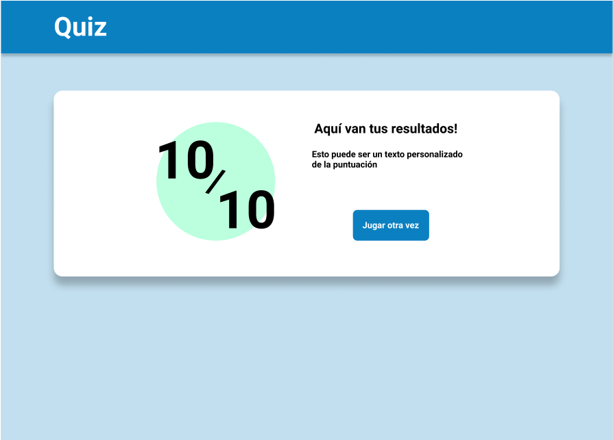

# 🧠 Quiz SPA - Proyecto Final JS

Bienvenida a nuestro proyecto de Quiz realizado en JavaScript usando una estructura SPA (Single Page Application). Este proyecto fue desarrollado como ejercicio final para aplicar todos los conocimientos adquiridos durante el módulo de JavaScript en el bootcamp.

---

## 🎯 Objetivo

- Crear una aplicación web interactiva de preguntas y respuestas.
- Incluir preguntas propias y también obtenidas desde una API externa.
- Visualizar resultados finales y mostrar un historial con gráfica.
- Todo en una sola página (SPA), sin recargas.

---

## 🔧 Funcionalidades

- ✅ Interfaz de bienvenida con botón de inicio y gráfico de resultados anteriores.
- ✅ Consumo de API externa (`https://the-trivia-api.com`) con preguntas aleatorias.
- ✅ 10 preguntas por partida, con 4 respuestas posibles.
- ✅ Colores visuales según respuestas correctas/incorrectas.
- ✅ Registro de puntuación en `localStorage` con fecha.
- ✅ Visualización de resultados anteriores con `Chart.js`.
- ✅ SPA 100%: sin recargar páginas, navegación interna con JS.

---

## 🧪 Tecnologías utilizadas

- HTML5
- CSS3 (Responsive, Mobile First)
- JavaScript (ES6)
- API externa de preguntas: [The Trivia API](https://the-trivia-api.com/)
- LocalStorage (HTML5)
- Chart.js (para gráficas)

---

## 📸 Capturas

### 🏠 Vista inicial (Home)


### ❓ Vista de preguntas (Quiz)


### 📊 Vista de resultados


---

## 🚀 ¿Cómo ejecutar el proyecto?

1. Clona el repositorio:
```bash
git clone https://github.com/tu-usuario/quiz-spa.git
